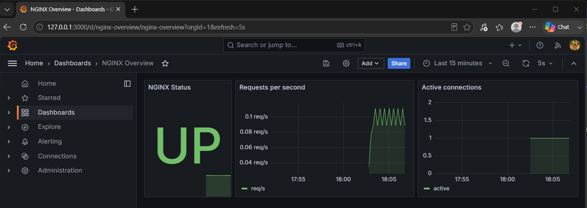
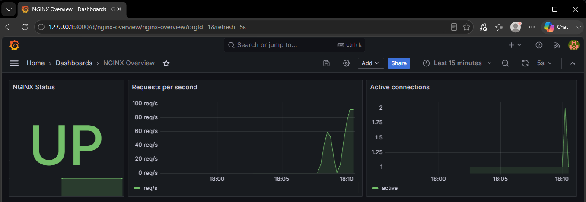
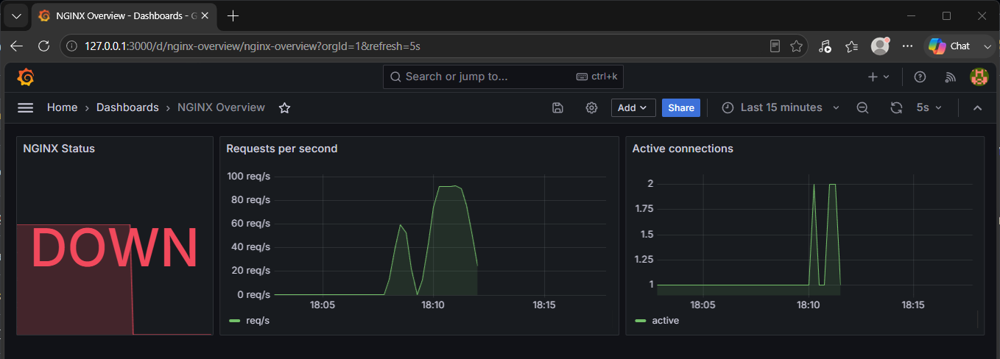
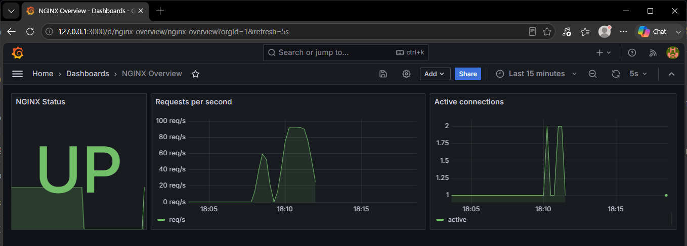
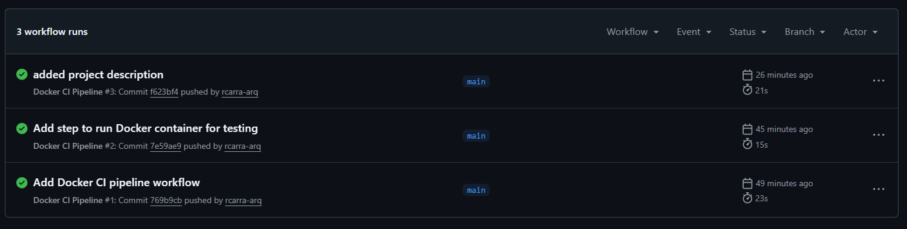
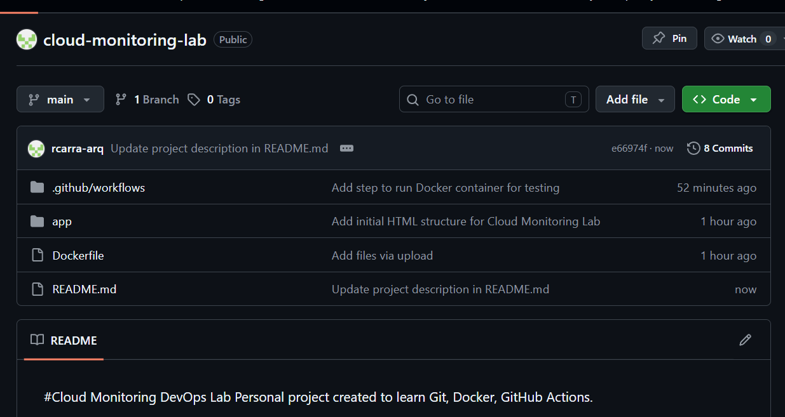
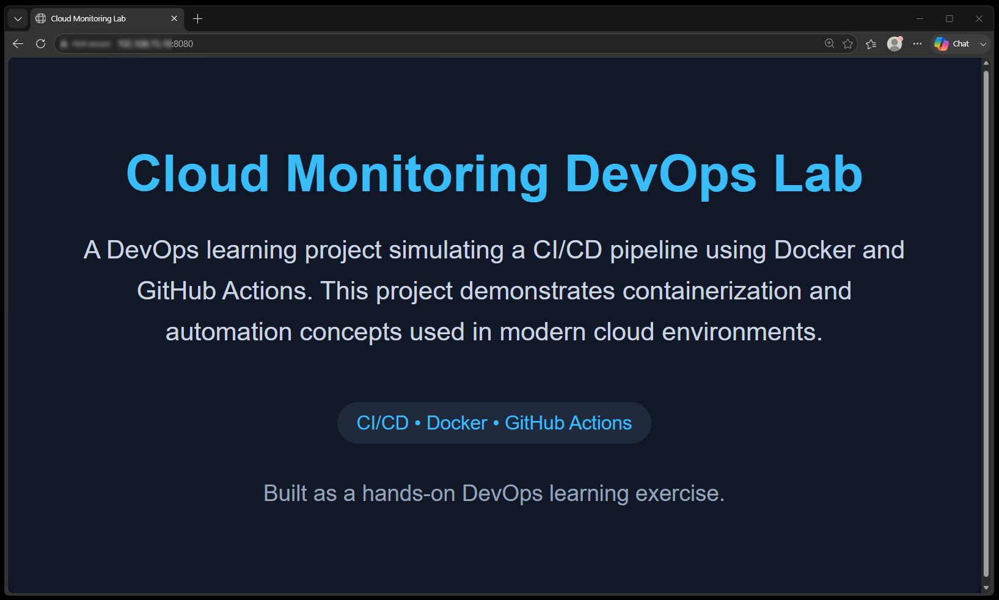

# Cloud Monitoring DevOps Lab

A hands-on observability lab: a containerized web app monitored by a full
**Prometheus + Grafana** stack, with a CI pipeline that builds, smoke-tests
and security-scans the image — and tests the entire monitoring stack
end-to-end on every change. Everything runs locally with Docker:
**zero cloud cost**.

*Versão em português abaixo.* 🇧🇷

---

## Architecture

```
Developer ──push──▶ GitHub ──▶ GitHub Actions
                               ├─ build image
                               ├─ smoke test (HTTP 200)
                               ├─ Trivy vulnerability scan
                               └─ full-stack test (compose up + health checks)

docker compose up -d
   ├── app             nginx:1.31-alpine + HEALTHCHECK      → :8080
   ├── nginx-exporter  reads nginx /stub_status             (internal)
   ├── prometheus      scrapes metrics + NginxDown alert    → :9090
   └── grafana         pre-provisioned NGINX dashboard      → :3000
```

## Stack

| Component | Role |
|---|---|
| nginx (alpine, pinned) | The web app being monitored, with a Docker `HEALTHCHECK` |
| nginx-prometheus-exporter | Translates nginx's `/stub_status` counters into Prometheus metrics |
| Prometheus | Scrapes metrics every 15s; fires the `NginxDown` alert if nginx stops answering |
| Grafana | Dashboard (status, requests/s, active connections) provisioned automatically — no manual setup |
| GitHub Actions | CI: build, smoke test, Trivy scan, and an end-to-end test of the whole stack |

## How it works — the journey of a metric

```
you / curl ──▶ nginx (app)            serves the page on :8080 and counts
                 │                    every request internally
                 │ /stub_status       raw counters, internal port 8081
                 ▼                    (never published to the host)
           nginx-exporter             reads the counters and re-exposes them
                 │                    in Prometheus format on :9113
                 ▼   scraped every 15s
            Prometheus                stores the time series and evaluates
                 │                    alert rules: NginxDown fires after the
                 │                    app is unreachable for 30s
                 ▼   PromQL queries
             Grafana                  draws the dashboard, refreshing every 5s
```

Two extra safety nets run underneath: Docker's `HEALTHCHECK` (the engine
itself probes nginx and marks the container unhealthy if it stops answering)
and the `restart: unless-stopped` policy (a crashed container is brought
back automatically).

## Quick start

Requires [Docker Desktop](https://www.docker.com/products/docker-desktop/) (or Docker Engine + compose v2).

```bash
docker compose up -d --build
```

| URL | What you see |
|---|---|
| http://localhost:8080 | The application |
| http://localhost:9090 | Prometheus (try Status → Targets, and Alerts) |
| http://localhost:3000 | Grafana — login `admin` / `admin`, dashboard "NGINX Overview" already loaded |

Tear down with `docker compose down`.

### Access notes (VMs and older Docker)

- **Older Docker without the compose plugin** (`unknown shorthand flag: 'd'`):
  use the standalone binary — same commands with a hyphen, `docker-compose up -d --build`.
- **`permission denied ... docker.sock`**: your user is not in the `docker`
  group. Either prefix commands with `sudo`, or fix it once with
  `sudo usermod -aG docker $USER` and log out/in.
- **Running inside a VirtualBox VM (NAT)**: forward host ports 8080, 9090 and
  3000 to the guest (Settings → Network → Port Forwarding), then browse from
  the host at `http://127.0.0.1:3000`. Prefer `127.0.0.1` over `localhost` on
  Windows: `localhost` resolves to IPv6 `::1` first, and VirtualBox NAT
  forwarding listens on IPv4 only — so `localhost` refuses while `127.0.0.1`
  works.

## Lab exercises (break things on purpose)

1. **Watch traffic appear** — generate load and watch the Grafana graphs react:
   ```bash
   while true; do curl -s http://localhost:8080 > /dev/null; done
   ```
2. **Kill the app and watch the alert fire** — stop the container, then open
   Prometheus → Alerts and watch `NginxDown` go PENDING → FIRING (~30s).
   Grafana's status panel turns red DOWN:
   ```bash
   docker stop monitoring-lab-app
   ```
3. **Self-healing** — start it again (`docker start monitoring-lab-app`) and
   watch everything recover. The `restart: unless-stopped` policy plays the
   same role the Auto Scaling Group plays in my
   [AWS HA project](https://github.com/rcarra-arq/aws-highly-available-webapp-terraform):
   detect failure, restore service.

## CI pipeline

Every push and pull request:

1. **Build** the Docker image
2. **Smoke test** — a detached `docker run` alone always "passes", so the
   pipeline actually curls the container and fails unless it answers HTTP 200
3. **Trivy scan** — fails the build on CRITICAL/HIGH vulnerabilities with an
   available fix
4. **Full-stack test** — brings up the entire compose stack and verifies:
   app answers, Prometheus is healthy *and actually scraping* `nginx_up == 1`,
   Grafana is healthy

## Cost-conscious design

This lab is intentionally a **zero-cloud-cost project**: everything runs
locally or on GitHub Actions (free for public repositories). The image is
pinned to `nginx:1.31-alpine` (~8 MB vs ~190 MB for the default image) —
faster pulls, faster CI, smaller attack surface. For the real cloud cost
story (resource tagging, AWS Budget alerts, per-resource estimates), see
[aws-highly-available-webapp-terraform](https://github.com/rcarra-arq/aws-highly-available-webapp-terraform).

## Challenges & Troubleshooting

**`ssh -p 2222` kept returning `Connection refused` when connecting to the
VM this lab runs in.** The setup is a VirtualBox VM with NAT networking and
host ports forwarded to the guest (2222 → 22 for SSH, plus 8080/9090/3000 for
the stack). The confusing part was that a host-side port test reported 2222 as
*open* — yet SSH refused. The catch: with VirtualBox NAT, the host accepts the
TCP handshake on a forwarded port **regardless of whether anything is
listening inside the guest**, so "the port answers" proved nothing. Checking
from inside the VM with `systemctl is-active ssh` revealed the service was
`inactive` — `openssh-server` was installed but never started. `sudo systemctl
enable --now ssh` started it (and enabled it on boot), and `ss -tlnp | grep
:22` confirmed sshd was finally listening. Lesson: `Connection refused` means
the destination is reachable but nothing is accepting on that port — and a
NAT port-forward test on the host tells you nothing about whether the guest
service is actually up.

## Screenshots — the lab in action

The full resilience cycle, captured live while running the lab exercises:

**1. Healthy baseline — first traffic arriving**


**2. Load test — the curl loop drives requests towards ~100 req/s**


**3. Failure injected — container stopped: status DOWN, traffic flatlines, the `NginxDown` alert fires in Prometheus**


**4. Recovery — container restarted; note the outage window still visible in the status panel's history**


### CI/CD Pipeline (GitHub Actions)


### Repository Overview


### Application Running (Docker)


---
---

# 🇧🇷 Cloud Monitoring DevOps Lab (Português)

Laboratório prático de observabilidade: uma aplicação containerizada
monitorada por um stack completo **Prometheus + Grafana**, com pipeline de CI
que builda, testa e escaneia a imagem — e testa o stack de monitoramento
inteiro de ponta a ponta a cada mudança. Tudo roda localmente com Docker:
**custo zero de nuvem**.

## Como funciona — o caminho de uma métrica

```
você / curl ──▶ nginx (app)           serve a página em :8080 e conta cada
                  │                   requisição internamente
                  │ /stub_status      contadores brutos, porta interna 8081
                  ▼                   (nunca publicada para o host)
            nginx-exporter            lê os contadores e os re-expõe no
                  │                   formato Prometheus em :9113
                  ▼   coletado a cada 15s
             Prometheus               armazena as séries temporais e avalia
                  │                   as regras de alerta: NginxDown dispara
                  │                   após 30s sem resposta da aplicação
                  ▼   consultas PromQL
              Grafana                 desenha o dashboard, atualizando a cada 5s
```

Duas redes de segurança extras por baixo: o `HEALTHCHECK` do Docker (o
próprio engine sonda o nginx e marca o container como unhealthy se ele parar
de responder) e a política `restart: unless-stopped` (container que morre
volta sozinho).

## Como executar

Requer o [Docker Desktop](https://www.docker.com/products/docker-desktop/).

```bash
docker compose up -d --build
```

| URL | O que aparece |
|---|---|
| http://localhost:8080 | A aplicação |
| http://localhost:9090 | Prometheus (veja Status → Targets, e Alerts) |
| http://localhost:3000 | Grafana — login `admin` / `admin`, dashboard "NGINX Overview" já carregado |

Para derrubar tudo: `docker compose down`.

### Notas de acesso (VMs e Docker antigo)

- **Docker antigo sem o plugin compose** (`unknown shorthand flag: 'd'`): use
  o binário clássico — mesmos comandos com hífen, `docker-compose up -d --build`.
- **`permission denied ... docker.sock`**: seu usuário não está no grupo
  `docker`. Use `sudo` na frente dos comandos, ou resolva de vez com
  `sudo usermod -aG docker $USER` e faça logout/login.
- **Rodando numa VM VirtualBox (NAT)**: redirecione as portas 8080, 9090 e
  3000 do host para o guest (Configurações → Rede → Redirecionamento de
  Portas) e acesse do host em `http://127.0.0.1:3000`. Prefira `127.0.0.1` a
  `localhost` no Windows: `localhost` resolve primeiro para o IPv6 `::1`, e o
  NAT do VirtualBox só escuta em IPv4 — então `localhost` recusa enquanto
  `127.0.0.1` funciona.

## Exercícios de laboratório (quebre de propósito)

1. **Gere tráfego** com um loop de `curl` e veja os gráficos do Grafana reagirem.
2. **Derrube a aplicação** (`docker stop monitoring-lab-app`) e veja o alerta
   `NginxDown` disparar no Prometheus (~30s) e o painel do Grafana ficar
   vermelho.
3. **Auto-recuperação** — suba de novo e veja tudo normalizar. A política
   `restart: unless-stopped` faz aqui o papel que o Auto Scaling Group faz no
   meu [projeto AWS de alta disponibilidade](https://github.com/rcarra-arq/aws-highly-available-webapp-terraform):
   detectar falha e restaurar o serviço.

## Pipeline de CI

A cada push/PR: build da imagem → smoke test real (exige HTTP 200) → scan de
vulnerabilidades com Trivy → teste de ponta a ponta do stack completo
(aplicação responde, Prometheus coletando `nginx_up == 1`, Grafana saudável).

## Desafios & Troubleshooting

**`ssh -p 2222` retornava `Connection refused` ao conectar na VM onde este lab
roda.** O ambiente é uma VM VirtualBox com rede NAT e portas do host
redirecionadas para o guest (2222 → 22 para SSH, além de 8080/9090/3000 para o
stack). O detalhe enganoso: um teste de porta no host indicava a 2222 como
*aberta* — mas o SSH recusava. A pegadinha: no NAT do VirtualBox o host aceita
o handshake TCP na porta redirecionada **independentemente de haver algo
escutando no guest**, então "a porta responde" não provava nada. Dentro da VM,
`systemctl is-active ssh` mostrou o serviço `inactive`: o `openssh-server`
estava instalado mas nunca fora iniciado. `sudo systemctl enable --now ssh`
subiu o serviço (e o habilitou no boot), e `ss -tlnp | grep :22` confirmou o
sshd finalmente escutando. Lição: `Connection refused` significa que o destino
é alcançável mas nada aceita naquela porta — e um teste de port-forward no host
não diz nada sobre o serviço do guest estar de pé.

## Custo consciente por design

Projeto de custo zero de nuvem: tudo local ou no GitHub Actions (gratuito
para repositórios públicos). Imagem pinada em `nginx:1.31-alpine` (~8 MB
contra ~190 MB da padrão). Para controles de custo em nuvem real (tagging,
budget alert, estimativas), veja o
[aws-highly-available-webapp-terraform](https://github.com/rcarra-arq/aws-highly-available-webapp-terraform).
